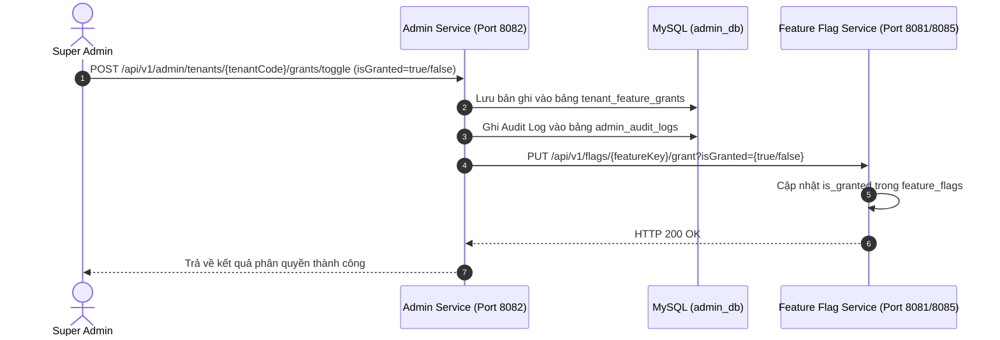

# 🏛️ Admin Feature Flag Service - Central Control Plane

> Hệ thống điều phối trung tâm (Central Control Plane) quản lý danh mục cờ toàn cục (Master Features), đối tác (Tenants / Khách hàng) và phân quyền cấp phép cờ tính năng (Feature Grants) trong kiến trúc Microservices đa đối tác (Multi-Tenant).

---

## 🌐 Hệ sinh thái Microservices (Ecosystem Navigation)

Dự án này là tầng điều khiển trung tâm (Control Plane) trong hệ sinh thái Microservices:

| Tầng kiến trúc (Plane) | Tên Service / Repository | Vai trò & Trách nhiệm chính | Trạng thái Repo |
| :--- | :--- | :--- | :---: |
| **1. Control Plane** | [🏛️ `admin-feature-flag-service`](https://github.com/duymk123/admin-feature-flag-service) | **👉 Đang ở đây (Repo này):** Quản lý đối tác (Tenants), danh mục cờ toàn cục (Master Features), cấp quyền cờ cho từng tenant | **Hoàn thành** |
| **2. Tenant Flag Plane** | [🚩 `feature-flag-service`](https://github.com/duymk123/feature-flag-service) | Cấu hình rule theo role/user/percentage, đóng gói & đẩy file snapshot cấu hình sang ứng dụng | [Xem README](https://github.com/duymk123/feature-flag-service#readme) |
| **3. Core SDK Lib** | [📦 `feature-flag-lib`](https://github.com/duymk123/feature-flag-lib) | Thư viện Java SDK in-memory evaluation (~0ms latency), cung cấp annotation `@RequireFeature` | Đã tích hợp |
| **4. Business App Plane** | [🛒 `tracking-order`](https://github.com/duymk123/Tracking-Order) | Nghiệp vụ E-commerce, Order Tracking, nhận file snapshot và thực thi cờ | [Xem README](https://github.com/duymk123/Tracking-Order#readme) |

```
[ admin-feature-flag-service ] ──(Grant cờ)──► [ feature-flag-service ] ──(Sync File)──► [ tracking-order ]
      (Central Control Plane)                       (Tenant Flag Plane)                     (Business App)
```

---

## 📑 Mục lục (Table of Contents)

1. [Giới thiệu tổng quan](#1-giới-thiệu-tổng-quan)
   - [1.1. Mục đích & Vai trò hệ thống](#11-mục-đích--vai-trò-hệ-thống)
   - [1.2. Các bài toán giải quyết](#12-các-bài-toán-giải-quyết)
2. [Kiến trúc & Công nghệ sử dụng](#2-kiến-trúc--công-nghệ-sử-dụng)
   - [2.1. Tech Stack & Dependencies chính](#21-tech-stack--dependencies-chính)
   - [2.2. Cơ chế xác thực & Phân quyền](#22-cơ-chế-xác-thực--phân-quyền)
   - [2.3. Điều phối Đa Tenant (Multi-Tenant Routing)](#23-điều-phối-đa-tenant-multi-tenant-routing)
3. [Cấu trúc thư mục dự án](#3-cấu-trúc-thư-mục-dự-án)
4. [Cơ sở dữ liệu (Database Schema)](#4-cơ-sở-dữ-liệu-database-schema)
   - [4.1. Bảng `master_features`](#41-bảng-master_features)
   - [4.2. Bảng `tenants`](#42-bảng-tenants)
   - [4.3. Bảng `tenant_feature_grants`](#43-bảng-tenant_feature_grants)
   - [4.4. Bảng `admin_audit_logs`](#44-bảng-admin_audit_logs)
5. [Cơ chế cấp quyền & Đồng bộ chéo (Cross-Service Sync)](#5-cơ-chế-cấp-quyền--đồng-bộ-chéo-cross-service-sync)
   - [5.1. Luồng Super Admin cấp quyền (Grant Flow)](#51-luồng-super-admin-cấp-quyền-grant-flow)
   - [5.2. Luồng kích hoạt Apply từ xa (Remote Apply)](#52-luồng-kích-hoạt-apply-từ-xa-remote-apply)
   - [5.3. Khởi tạo dữ liệu mẫu tự động (Data Seeding)](#53-khởi-tạo-dữ-liệu-mẫu-tự-động-data-seeding)
6. [Danh mục API Endpoints](#6-danh-mục-api-endpoints)
7. [Hướng dẫn cài đặt & Khởi chạy](#7-hướng-dẫn-cài-đặt--khởi-chạy)
   - [7.1. Yêu cầu môi trường](#71-yêu-cầu-môi-trường)
   - [7.2. Cấu hình `application.yaml`](#72-cấu-hình-applicationyaml)
   - [7.3. Khởi tạo Cơ sở dữ liệu](#73-khởi-tạo-cơ-sở-dữ-liệu)
   - [7.4. Khởi chạy Backend](#74-khởi-chạy-backend)
   - [7.5. Khởi chạy Giao diện Frontend Admin Portal](#75-khởi-chạy-giao-diện-frontend-admin-portal)
   - [7.6. Chạy với Docker Compose](#76-chạy-với-docker-compose)
8. [Hướng dẫn sử dụng API (Request/Response mẫu)](#8-hướng-dẫn-sử-dụng-api-requestresponse-mẫu)
9. [Trạng thái phát triển & Ghi chú kỹ thuật (TODOs)](#9-trạng-thái-phát-triển--ghi-chú-kỹ-thuật-todos)

---

## 1. Giới thiệu tổng quan

### 1.1. Mục đích & Vai trò hệ thống
Trong mô hình SaaS hoặc hệ thống doanh nghiệp phân tán phục vụ nhiều đối tác (Multi-Tenant), **`admin-feature-flag-service`** đóng vai trò là **Hệ thống điều khiển trung tâm (Control Plane)** duy nhất:
- Nắm giữ toàn bộ danh mục tính năng gốc của nền tảng (Master Features).
- Quản lý danh sách các công ty/đơn vị thuê bao (Tenants).
- Quyết định Tenant nào được phép sử dụng tính năng nào (Feature Entitlement / Granting).
- Đóng vai trò tổng chỉ huy: Bất cứ khi nào Super Admin thay đổi phân quyền cờ cho một Tenant, service sẽ lập tức gửi lệnh HTTP REST đồng bộ sang instance của Tenant đó ([feature-flag-service](https://github.com/duymk123/feature-flag-service)).

### 1.2. Các bài toán giải quyết
1. **Phân quyền tính năng cấp độ B2B / Tenant:**
   - Khách hàng gói Cơ bản chỉ được cấp cờ `BUY_NOW`; khách hàng gói Nâng cao được cấp thêm cờ `PRICE_INCREASE` và `ORDER_DETAIL`.
2. **Thu hồi tính năng tức thì (Instant Revocation):**
   - Khi Super Admin gạt công tắc thu hồi quyền (`REVOKE`), cờ trên instance của Tenant sẽ lập tức bị khóa và tự động tắt, ngăn chặn việc sử dụng trái phép.
3. **Theo dõi nhật ký vận hành tập trung (Centralized Audit Trail):**
   - Lưu trữ toàn bộ lịch sử thao tác của các quản trị viên cấp cao đối với từng tenant để phục vụ đối soát, bảo mật.
4. **Hỗ trợ giao diện quản trị chuyên nghiệp:**
   - Tích hợp tài liệu tương tác Swagger UI (`/swagger-ui.html`) và Cổng thông tin Super Admin bằng React/Vite (`Frontend/`).

---

## 2. Kiến trúc & Công nghệ sử dụng

### 2.1. Tech Stack & Dependencies chính
Trích xuất từ file [pom.xml](file:///d:/Code/admin-feature-flag-service/pom.xml):

| Thư viện / Công nghệ | Phiên bản | Nhóm / Artifact ID | Mục đích sử dụng |
| :--- | :--- | :--- | :--- |
| **Java Platform** | **21** | `java.version: 21` | Ngôn ngữ nền tảng LTS |
| **Spring Boot** | **4.1.1** | `spring-boot-starter-parent` | Framework nền tảng dịch vụ |
| **Spring Data JPA** | 4.1.1 | `spring-boot-starter-data-jpa` | ORM & quản lý cơ sở dữ liệu với Hibernate |
| **Spring Web MVC** | 4.1.1 | `spring-boot-starter-webmvc` | Xây dựng RESTful API controllers |
| **Spring Validation** | 4.1.1 | `spring-boot-starter-validation` | Kiểm tra tính hợp lệ dữ liệu request `@Valid` |
| **Springdoc OpenAPI** | **2.8.5** | `springdoc-openapi-starter-webmvc-ui` | Tự động sinh Swagger UI & tài liệu API OpenAPI 3.0 |
| **MySQL Connector** | Managed | `com.mysql:mysql-connector-j` | Driver kết nối CSDL MySQL 8.0 |
| **Lombok** | Managed | `org.projectlombok:lombok` | Giảm tải boilerplate code (Builder, Getter, Setter) |
| **RestTemplate** | Managed | Spring Web | Client thực hiện gọi HTTP REST sang các Tenant Services |

### 2.2. Cơ chế xác thực & Phân quyền
- **Quản lý xác thực Super Admin (`AuthService`):**
  - Cung cấp API `POST /api/v1/auth/login`.
  - Tài khoản mặc định: `username: admin`, `password: 1`.
  - Khi đăng nhập thành công, hệ thống sinh phiên làm việc `admin-session-<UUID>` trả về cho Frontend Portal.
- **Cấu hình CORS (`CorsConfig`):** Cho phép tất cả các nguồn (`*`), hỗ trợ toàn bộ các method `GET`, `POST`, `PUT`, `PATCH`, `DELETE`, `OPTIONS` với `allowCredentials(true)`.

### 2.3. Điều phối Đa Tenant (Multi-Tenant Routing)
Class [FeatureFlagServiceClient.java](file:///d:/Code/admin-feature-flag-service/src/main/java/com/example/adminfeatureflagservice/client/FeatureFlagServiceClient.java) chịu trách nhiệm tự động phân giải địa chỉ mạng của từng Tenant:
- Nếu Tenant là `COMPANY_A` (hoặc cấu hình url cổng `8081`), request được định tuyến tới `FEATURE_FLAG_SERVICE_A_URL` (`http://localhost:8081`).
- Nếu Tenant là `COMPANY_B` (hoặc cấu hình url cổng `8085`), request được định tuyến tới `FEATURE_FLAG_SERVICE_B_URL` (`http://localhost:8085`).
- Mặc định trỏ về `FEATURE_FLAG_SERVICE_URL` (`http://localhost:8081`).

---

## 3. Cấu trúc thư mục dự án

```
admin-feature-flag-service/
├── data/
│   └── schema.sql                          # Script DDL tạo CSDL admin_db và 4 bảng chính
├── Dockerfile                              # Cấu hình containerization
├── Frontend/                               # Cổng thông tin Super Admin (React/Vite)
│   ├── src/
│   │   ├── pages/
│   │   │   ├── LoginPage.jsx               # Màn hình đăng nhập Super Admin
│   │   │   ├── DashboardPage.jsx           # Thống kê tổng quan cờ & đối tác
│   │   │   ├── TenantsPage.jsx             # Quản lý đối tác & gạt công tắc cấp cờ
│   │   │   └── AuditLogsPage.jsx           # Tra cứu lịch sử thao tác của Admin
│   │   ├── App.jsx
│   │   └── main.jsx
│   ├── package.json
│   └── vite.config.js
├── src/
│   ├── main/
│   │   ├── java/com/example/adminfeatureflagservice/
│   │   │   ├── AdminFeatureFlagServiceApplication.java # Class chính khởi chạy Spring Boot
│   │   │   │
│   │   │   ├── client/
│   │   │   │   └── FeatureFlagServiceClient.java # HTTP Client gọi sang Tenant Flag Services
│   │   │   │
│   │   │   ├── config/
│   │   │   │   ├── CorsConfig.java         # Cấu hình CORS mở
│   │   │   │   ├── DataInitializer.java    # Tự động nạp dữ liệu mẫu Master Features & Tenants
│   │   │   │   └── RestTemplateConfig.java # Khởi tạo Bean RestTemplate
│   │   │   │
│   │   │   ├── controller/
│   │   │   │   ├── AuditLogController.java # /api/v1/admin/audit-logs
│   │   │   │   ├── AuthController.java     # /api/v1/auth (Login)
│   │   │   │   ├── MasterFeatureController.java # /api/v1/admin/master-features
│   │   │   │   ├── SyncController.java     # /api/v1/admin/sync (Kích hoạt Apply từ xa)
│   │   │   │   ├── TenantController.java   # /api/v1/admin/tenants (CRUD đối tác)
│   │   │   │   └── TenantGrantController.java # /api/v1/admin/tenants/{tenantCode}/grants
│   │   │   │
│   │   │   ├── dto/
│   │   │   │   ├── audit/                  # AuditLogRes.java
│   │   │   │   ├── auth/                   # LoginRequest.java, LoginResponse.java
│   │   │   │   ├── common/                 # ApiResponse.java
│   │   │   │   ├── feature/                # MasterFeatureReq.java, MasterFeatureRes.java
│   │   │   │   ├── grant/                  # TenantGrantRes.java, TenantGrantToggleReq.java...
│   │   │   │   └── tenant/                 # TenantReq.java, TenantRes.java
│   │   │   │
│   │   │   ├── entity/
│   │   │   │   ├── AdminAuditLog.java      # Entity admin_audit_logs
│   │   │   │   ├── MasterFeature.java      # Entity master_features
│   │   │   │   ├── Tenant.java             # Entity tenants
│   │   │   │   └── TenantFeatureGrant.java # Entity tenant_feature_grants
│   │   │   │
│   │   │   ├── exception/
│   │   │   │   ├── AppException.java       # Ngoại lệ chung kèm HttpStatus
│   │   │   │   └── GlobalExceptionHandler.java # Bắt lỗi toàn cục @RestControllerAdvice
│   │   │   │
│   │   │   ├── repository/
│   │   │   │   ├── AdminAuditLogRepository.java
│   │   │   │   ├── MasterFeatureRepository.java
│   │   │   │   ├── TenantFeatureGrantRepository.java
│   │   │   │   └── TenantRepository.java
│   │   │   │
│   │   │   └── service/
│   │   │       ├── AuditLogService.java / AuditLogServiceImpl.java
│   │   │       ├── AuthService.java / AuthServiceImpl.java
│   │   │       ├── MasterFeatureService.java / MasterFeatureServiceImpl.java
│   │   │       ├── SyncService.java / SyncServiceImpl.java
│   │   │       ├── TenantGrantService.java / TenantGrantServiceImpl.java
│   │   │       └── TenantService.java / TenantServiceImpl.java
│   │   │
│   │   └── resources/
│   │       └── application.yaml            # Cấu hình port 8082, CSDL admin_db, URLs các tenant
│   └── test/
└── pom.xml
```

---

## 4. Cơ sở dữ liệu (Database Schema)

Cơ sở dữ liệu sử dụng: `admin_db` (MySQL 8.0).

### 4.1. Bảng `master_features`
Danh mục cờ gốc do Super Admin định nghĩa và quản lý:

| Cột (Column) | Kiểu dữ liệu | Ràng buộc | Mô tả chức năng |
| :--- | :--- | :---: | :--- |
| `id` | `VARCHAR(36)` | PK | UUID tự động sinh |
| `feature_key` | `VARCHAR(100)` | UNIQUE, NOT NULL | Mã cờ hệ thống (VD: `BUY_NOW`, `ORDER_DETAIL`, `PRICE_INCREASE`) |
| `name` | `VARCHAR(255)` | NOT NULL | Tên hiển thị thân thiện |
| `description` | `TEXT` | NULL | Mô tả chi tiết tính năng |
| `is_active` | `BOOLEAN` | NOT NULL, DEFAULT `TRUE` | Trạng thái phát hành toàn cục của tính năng |
| `created_at` | `DATETIME` | NOT NULL | Thời điểm tạo |
| `updated_at` | `DATETIME` | NOT NULL | Thời điểm cập nhật cuối cùng |

### 4.2. Bảng `tenants`
Danh sách các đối tác, khách hàng hoặc các instance ứng dụng:

| Cột (Column) | Kiểu dữ liệu | Ràng buộc | Mô tả chức năng |
| :--- | :--- | :---: | :--- |
| `id` | `VARCHAR(36)` | PK | UUID tự động sinh |
| `tenant_code` | `VARCHAR(100)` | UNIQUE, NOT NULL | Mã định danh khách hàng (VD: `COMPANY_A`, `COMPANY_B`) |
| `name` | `VARCHAR(255)` | NOT NULL | Tên công ty / đơn vị đối tác |
| `ip_address` | `VARCHAR(50)` | NULL | Địa chỉ IP đăng ký |
| `service_url` | `VARCHAR(255)` | NULL | URL service của đối tác |
| `status` | `VARCHAR(50)` | NOT NULL, DEFAULT `'ACTIVE'` | Trạng thái hoạt động (`ACTIVE`, `INACTIVE`) |
| `created_at` | `DATETIME` | NOT NULL | Thời điểm tạo |
| `updated_at` | `DATETIME` | NOT NULL | Thời điểm cập nhật cuối cùng |

### 4.3. Bảng `tenant_feature_grants`
Bảng trung gian liên kết Phân quyền Cờ cho từng Tenant:

| Cột (Column) | Kiểu dữ liệu | Ràng buộc | Mô tả chức năng |
| :--- | :--- | :---: | :--- |
| `id` | `VARCHAR(36)` | PK | UUID tự động sinh |
| `tenant_id` | `VARCHAR(36)` | FK $\rightarrow$ `tenants.id` | Mã định danh Tenant |
| `feature_id` | `VARCHAR(36)` | FK $\rightarrow$ `master_features.id`| Mã định danh Master Feature |
| `is_granted` | `BOOLEAN` | NOT NULL, DEFAULT `FALSE` | Cờ đã được cấp quyền hay chưa (`TRUE`/`FALSE`) |
| `granted_at` | `DATETIME` | NOT NULL | Thời điểm cấp/sửa quyền |
| `granted_by` | `VARCHAR(100)` | DEFAULT `'admin'` | Tên Super Admin thực hiện cấp quyền |

*(Khóa duy nhất: `UNIQUE KEY uk_tenant_feature (tenant_id, feature_id)`)*.

### 4.4. Bảng `admin_audit_logs`
Nhật ký kiểm toán tập trung cho các thao tác của Super Admin:

| Cột (Column) | Kiểu dữ liệu | Ràng buộc | Mô tả chức năng |
| :--- | :--- | :---: | :--- |
| `id` | `VARCHAR(36)` | PK | UUID tự động sinh |
| `tenant_code` | `VARCHAR(100)` | NOT NULL | Mã khách hàng bị tác động |
| `feature_key` | `VARCHAR(100)` | NOT NULL | Mã cờ bị thay đổi |
| `action` | `VARCHAR(50)` | NOT NULL | Hành động: `GRANT`, `REVOKE` |
| `old_value` | `VARCHAR(50)` | NULL | Trạng thái trước khi đổi (`'false'` hoặc `'true'`) |
| `new_value` | `VARCHAR(50)` | NOT NULL | Trạng thái mới (`'true'` hoặc `'false'`) |
| `performed_by` | `VARCHAR(100)` | NOT NULL | Tên admin thực hiện |
| `created_at` | `DATETIME` | NOT NULL | Thời điểm ghi log |

---

## 5. Cơ chế cấp quyền & Đồng bộ chéo (Cross-Service Sync)

### 5.1. Luồng Super Admin cấp quyền (Grant Flow)


### 5.2. Luồng kích hoạt Apply từ xa (Remote Apply)
Khi Super Admin muốn chủ động ép buộc một Tenant cập nhật cấu hình mới nhất sang ứng dụng của họ mà không cần Tenant can thiệp:
1. Super Admin gọi: `POST /api/v1/admin/sync/apply/{tenantCode}`.
2. `admin-feature-flag-service` gọi tiếp: `POST /api/v1/flags/apply` trên `feature-flag-service` của Tenant đó.
3. `feature-flag-service` lập tức đóng gói snapshot file và bắn sang `tracking-order`.

### 5.3. Khởi tạo dữ liệu mẫu tự động (Data Seeding)
Tại thời điểm khởi động, class [DataInitializer.java](file:///d:/Code/admin-feature-flag-service/src/main/java/com/example/adminfeatureflagservice/config/DataInitializer.java) sẽ tự động kiểm tra CSDL và nạp dữ liệu mẫu ban đầu:
- **3 Master Features:**
  - `BUY_NOW`: Mua Ngay (Buy Now)
  - `ORDER_DETAIL`: Chi Tiết Đơn Hàng (Order Detail)
  - `PRICE_INCREASE`: Tăng Giá Tự Động (Price Increase)
- **2 Tenants:**
  - `COMPANY_A`: Viettel Software - Company A (Service: `http://tracking-order-a:8080`)
  - `COMPANY_B`: Viettel Logistics - Company B (Service: `http://tracking-order-b:8080`)
- **Tự động phân quyền (Grants):** Cấp quyền toàn bộ 3 cờ trên cho cả 2 Tenant và gửi tín hiệu đồng bộ sang các container Tenant Flag Services.

---

## 6. Danh mục API Endpoints

Tất cả các API trả về cấu trúc chuẩn:
```json
{
  "code": 200,
  "message": "Thành công",
  "data": { ... }
}
```

| Method | Endpoint Path | Mô tả nghiệp vụ | Body Request / Params | DTO Phản hồi |
| :---: | :--- | :--- | :--- | :--- |
| `POST` | `/api/v1/auth/login` | Đăng nhập tài khoản Super Admin | `LoginRequest` (`admin` / `1`) | `ApiResponse<LoginResponse>` |
| `GET` | `/api/v1/admin/master-features` | Lấy danh sách toàn bộ Master Features toàn cục | *None* | `ApiResponse<List<MasterFeatureRes>>` |
| `GET` | `/api/v1/admin/tenants` | Lấy danh sách tất cả các Tenant đối tác | *None* | `ApiResponse<List<TenantRes>>` |
| `POST` | `/api/v1/admin/tenants` | Khởi tạo một đối tác (Tenant) mới | `TenantReq` | `ApiResponse<TenantRes>` |
| `PUT` | `/api/v1/admin/tenants/{id}` | Cập nhật thông tin Tenant theo ID | Path: `id`, Body: `TenantReq` | `ApiResponse<TenantRes>` |
| `DELETE` | `/api/v1/admin/tenants/{id}` | Xóa một Tenant | Path: `id` | `ApiResponse<Void>` |
| `GET` | `/api/v1/admin/tenants/{tenantCode}/grants` | Lấy danh sách trạng thái phân quyền cờ của Tenant | Path: `tenantCode` | `ApiResponse<List<TenantGrantRes>>` |
| `POST` / `PATCH` | `/api/v1/admin/tenants/{tenantCode}/grants/toggle` | Bật/Tắt cấp quyền (`GRANT`/`REVOKE`) cờ cho Tenant (tự động đồng bộ sang Tenant Flag Service) | Path: `tenantCode`, Body: `TenantGrantToggleReq` | `ApiResponse<TenantGrantRes>` |
| `POST` | `/api/v1/admin/tenants/{tenantCode}/grants/batch` | Phân quyền cờ hàng loạt cho một Tenant | Path: `tenantCode`, Body: `TenantGrantBatchReq` | `ApiResponse<List<TenantGrantRes>>` |
| `GET` | `/api/v1/admin/audit-logs` | Xem toàn bộ lịch sử Audit Log của Super Admin | *None* | `ApiResponse<List<AuditLogRes>>` |
| `GET` | `/api/v1/admin/audit-logs/by-tenant/{tenantCode}` | Xem lịch sử Audit Log lọc theo từng Tenant | Path: `tenantCode` | `ApiResponse<List<AuditLogRes>>` |
| `POST` | `/api/v1/admin/sync/apply/{tenantCode}` | Kích hoạt từ xa lệnh Apply snapshot sang ứng dụng của Tenant | Path: `tenantCode` | `Map<String, Object>` |

*(Giao diện tương tác Swagger UI có sẵn tại: `http://localhost:8082/swagger-ui.html`)*.

---

## 7. Hướng dẫn cài đặt & Khởi chạy

### 7.1. Yêu cầu môi trường
- **Java Platform:** JDK **21** trở lên.
- **Cơ sở dữ liệu:** **MySQL 8.0+**.
- **Node.js:** Phiên bản 18+ (nếu muốn chạy giao diện Admin Portal).

### 7.2. Cấu hình `application.yaml`
Kiểm tra cấu hình tại `src/main/resources/application.yaml`:
```yaml
server:
  port: 8082

spring:
  application:
    name: admin-service
  datasource:
    url: jdbc:mysql://localhost:3306/admin_db?useSSL=false&serverTimezone=UTC&allowPublicKeyRetrieval=true
    username: root
    password: root
  jpa:
    hibernate:
      ddl-auto: update

feature-flag:
  service:
    url: http://localhost:8081              # URL Tenant Service mặc định
    service-a-url: http://localhost:8081    # URL Tenant A
    service-b-url: http://localhost:8085    # URL Tenant B
```

### 7.3. Khởi tạo Cơ sở dữ liệu
Thực thi script SQL khởi tạo trong thư mục `data/`:
```bash
mysql -u root -p < data/schema.sql
```

### 7.4. Khởi chạy Backend
```bash
# Trên Windows:
.\mvnw.cmd clean spring-boot:run

# Trên Linux / macOS:
./mvnw clean spring-boot:run
```
Backend lắng nghe tại cổng `http://localhost:8082`.

### 7.5. Khởi chạy Giao diện Frontend Admin Portal
```bash
cd Frontend
npm install
npm run dev
```
Giao diện mở tại `http://localhost:5173`. Đăng nhập bằng `admin` / `1`.

### 7.6. Chạy với Docker Compose
Chạy toàn bộ cụm Admin trong hệ thống:
```bash
docker-compose up -d admin-feature-flag-db admin-feature-flag-service
```
Khi chạy qua Docker, Admin Service map ra cổng host `8084` (nội bộ container `8082`).

---

## 8. Hướng dẫn sử dụng API (Request/Response mẫu)

### 8.1. Đăng nhập Super Admin
- **Request:** `POST /api/v1/auth/login`
```bash
curl -X POST http://localhost:8082/api/v1/auth/login \
  -H "Content-Type: application/json" \
  -d '{
    "username": "admin",
    "password": "1"
  }'
```
- **Response (200 OK):**
```json
{
  "code": 200,
  "message": "Đăng nhập thành công!",
  "data": {
    "token": "admin-session-c1b2a3d4-e5f6-7890-abcd-1234567890ef",
    "tokenType": "Bearer",
    "username": "admin",
    "role": "SUPER_ADMIN"
  }
}
```

### 8.2. Cấp quyền cờ cho Tenant (Toggle Grant)
Cấp quyền cờ `PRICE_INCREASE` cho công ty `COMPANY_A`:
- **Request:** `POST /api/v1/admin/tenants/COMPANY_A/grants/toggle`
```bash
curl -X POST http://localhost:8082/api/v1/admin/tenants/COMPANY_A/grants/toggle \
  -H "Content-Type: application/json" \
  -d '{
    "featureKey": "PRICE_INCREASE",
    "isGranted": true,
    "performedBy": "admin"
  }'
```
- **Response (200 OK):**
```json
{
  "code": 200,
  "message": "Cập nhật phân quyền cờ thành công",
  "data": {
    "grantId": "grant-uuid-1111",
    "featureId": "feat-uuid-2222",
    "featureKey": "PRICE_INCREASE",
    "featureName": "Tăng Giá Tự Động (Price Increase)",
    "featureDescription": "Tính năng điều chỉnh giá sản phẩm tự động theo chiến dịch",
    "masterActive": true,
    "isGranted": true,
    "grantedAt": "2026-09-25T17:50:00",
    "grantedBy": "admin"
  }
}
```

### 8.3. Kích hoạt Apply từ xa cho Tenant
- **Request:** `POST /api/v1/admin/sync/apply/COMPANY_A`
```bash
curl -X POST http://localhost:8082/api/v1/admin/sync/apply/COMPANY_A
```
- **Response (200 OK):**
```json
{
  "status": "SUCCESS",
  "mode": "FILE_MULTIPART",
  "version": "2026-09-25T10:52:00.654321Z",
  "fileSizeBytes": 1542,
  "trackingOrderStatus": 200,
  "trackingOrderResponse": {
    "status": "SUCCESS",
    "message": "Feature flag snapshot synced from file stream",
    "syncedRows": 3
  }
}
```

---

## 9. Trạng thái phát triển & Ghi chú kỹ thuật (TODOs)

### 9.1. Các tính năng đã hoàn thiện
- ✅ Đầy đủ bộ 12 REST API quản lý Master Features, Tenants, Grants, Audit Logs và Remote Sync.
- ✅ Tích hợp sẵn Swagger UI trực quan tại `/swagger-ui.html`.
- ✅ Cơ chế định tuyến đa Tenant thông minh dựa theo Tenant Code và CSDL.
- ✅ Tự động nạp dữ liệu mẫu Master Features và Tenants khi khởi chạy lần đầu (`DataInitializer`).
- ✅ Giao diện Super Admin Portal hoàn chỉnh (React/Vite).

### 9.2. Ghi chú kỹ thuật & Đề xuất (TODOs)
1. ⚠️ **Bảo mật xác thực Admin:**
   - Trong `AuthServiceImpl.java`, tài khoản đang được fix cứng `admin:1` và cấp token dạng UUID ngẫu nhiên.
   - *Đề xuất:* Tích hợp bảng `admin_users`, mã hóa mật khẩu bằng `BCryptPasswordEncoder` và sinh token JWT có chữ ký nếu muốn tăng cường bảo mật cấp doanh nghiệp.
2. ⚠️ **Xử lý ngoại lệ mạng khi gọi sang Tenant Services:**
   - Khi một Tenant service bị sập, `syncTenantFeatureFlag` chỉ ghi log warning và tiếp tục lưu DB. Cần bổ sung cơ chế Retry Queue (như RabbitMQ / Kafka hoặc Spring Retry) để tự động đồng bộ lại khi Tenant service hoạt động trở lại.
